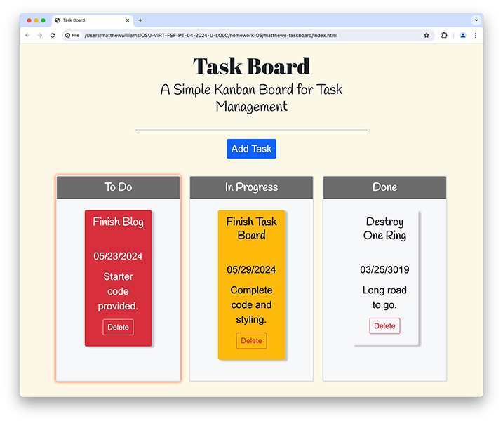

# Project Title
Matthew's Task Board, Challenge 5

## Description
Matthew's Task Board is a simple web app for recording and tracking tasks.

## Installation
Matthew's Task Board requires no installation.

## Usage
A screen shot of the form page of Matthew's Blog is presented below. To link to the blog, click [here](https://matthewwilliamscmh.github.io/matthews-task-board/index.html).

.

Using starter code, I wrote HTML, CSS, and Javascript that creates an interface--a task board--for tracking projects. I employed jQuery and Bootstrap libraries to enhance the functionality and appearance of the board. On opening the board, users are presented with three lanes of tasks: "To Do," "In Progress," and "Done" along with an "Add Task" button. When users click the "Add Task" button, they are form requiring a task title, the task's due date, and the task's description opens. The due-date field accesses the day.js JavaScript library to offer users a graphical interface for choosing a due date. Users may also type in the due date rather than choose one from the date picker. Users click the "New Task" button or hit "enter/return" on the keyboard to save a task to local storage; all three fields must be complete for a task to be saved. Task data, including an app-generated unique id, is written into local storage with a status of "To Do," and a to-do card is created and placed in the "To Do" lane. Users may drag and drop task cards among the three lanes as their status changes. Cards with a due date in the past will turn red, and those that are due on the day the application is opened will turn yellow to alert users to missed and imminent deadlines. When a task is complete, users click the "Delete" button on the relevant task card to remove it from the application.

## Credits
Our class worked through the unit's mini-project to understand how this application should work and to provide a model to refer to as we developed the task board. I also relied on a lot of hints and refreshers from the web sites, among the most helpful of which were specific-case posts on [Stack Overflow](https://stackoverflow.com), [SheCodes](https://www.shecodes.io/athena/), [MDN Web Docs](https://developer.mozilla.org), and [W3Schools](https://www.w3schools.com). At [The Design Space](https://thedesignspace.net/jquery-dialog-missing-x-from-close-button/#:~:text=This%20was%20caused%20by%20a,js%20and%20jquery%2Dui.), I found a fix for a missing "x" button in the close box on the input form.

## Version History
* 0.1
    * Initial Releasse

## License
Matthew's Task Board is licensed under the MIT License - see the LICENSE.md file for details.